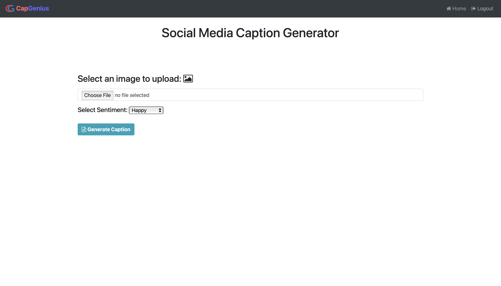
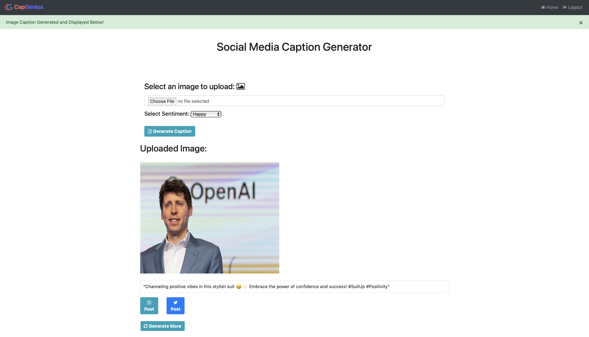

# Caption-Generation
- This project is a web based application that allows users to upload images and generate captions for those images. 
- Users can edit the generated caption and post that image and caption to social media(Instagram and Twitter X).
- It utilizes a pre-trained deep learning model for image captioning and a Flask-based user interface to make it accessible through a web browser.

## How it Works

### 1. User Interaction

 **User Uploads Image and Selects Sentiment:**
   - Users interact with the project by uploading an image.
   - They also select a sentiment that reflects the desired tone for the image caption.

### 2. User Interface

 **Flask Handles User Input:**
   - The project's user interface is built using Flask.
   - Flask processes the user's input, including the uploaded image and selected sentiment.

### 3. Image Description Generation

 **Keras:**
   - The project utilizes Keras to generate a textual description of the uploaded image.
   - This involves the use of a Convolutional Neural Network (CNN) and a Transformer model to extract meaningful information.

### 4. GPT API Integration

 **GPT API for Caption Enhancement:**
   - The generated image description is sent to a GPT (Generative Pre-trained Transformer) API.
   - The GPT API enhances the description, providing appealing captions, hashtags, and emoticons.

### 5. Social Media Posting

 **User Shares on Social Media:**
   - Users receive the enhanced image description and can choose to post the image along with the caption, hashtags, and emoticons to social media platforms like Instagram or Twitter.

### 6. Docker Integration

 **Dockerized Project:**
   - The project has been Dockerized for easy deployment.


## Project Portfolio

Check out our [Wix Project Portfolio](https://sdntbhardwaj.wixsite.com/cap-genius) to explore our team and working.

## How To Run?

- First, make sure to create and activate a virtual environment:

```bash
python -m venv venv_name  # Create a virtual environment

source venv_name/bin/activate  # Activate the virtual environment (for macOS/Linux)
      
venv_name\Scripts\activate  # Activate the virtual environment (for Windows) 
```
1. Install Requirements.txt

    ```bash 
    pip install -r Requirements.txt
    ```

2. Run the app.

      ```bash
      python main.py
      ```

## License

This project is licensed under the MIT License - see the [LICENSE](LICENSE) file for details.

## ScreenShots

#### Home Page


#### Project Demo




## References

1. Keras [Image Captioning Example](https://keras.io/examples/vision/image_captioning/)

2. Kaggle Dataset [Flickr Image Dataset](https://www.kaggle.com/datasets/hsankesara/flickr-image-dataset)
